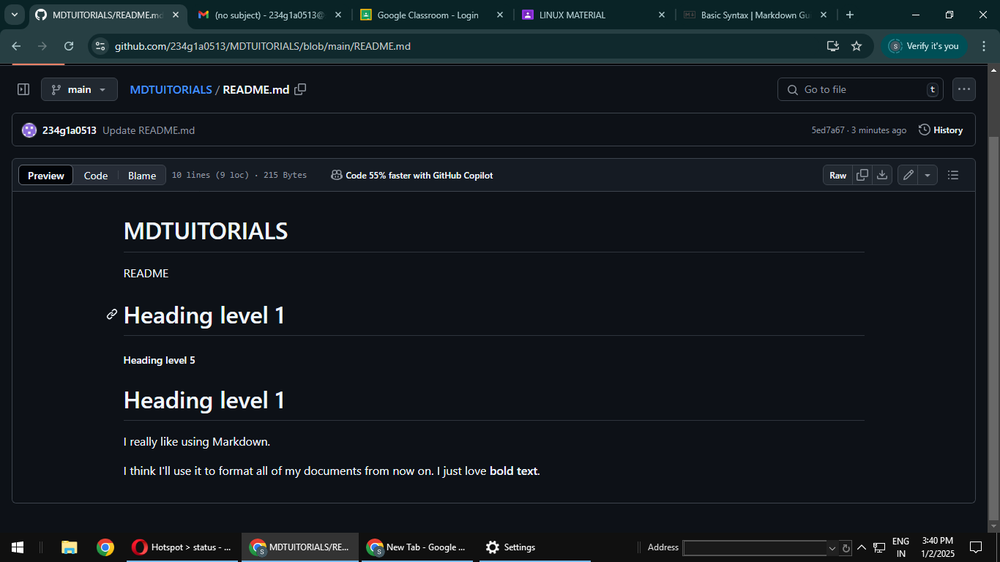

# MDTUITORIALS
README
# Heading level 1
##### Heading level 5
Heading level 1
===============
I really like using Markdown.

I think I'll use it to format all of my documents from now on.
I just love __bold text__.
A*cat*meow
This is really***very***important text.
## Heading level 2
<ol>
  <li>First item</li>
  <li>Second item</li>
  <li>Third item</li>
  <li>Fourth item</li>
</ol>

